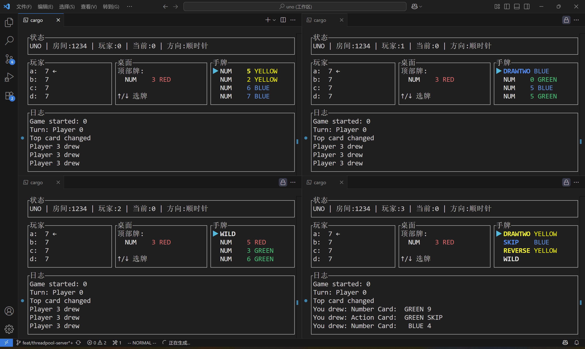

# UNO 纸牌游戏 🎮

一个用 Rust 写的终端版 UNO，多房间、异步服务器 + 彩色 TUI 客户端，轻量好玩！



## 特色亮点

- 多房间异步服务器：`server_multi_async`(Tokio，自动回收空闲房间)
- 教学用简单单房服务器：`server`
- 终端 TUI 客户端：彩色手牌、弹窗交互、比分面板
- 标准 UNO 规则：跳过 / 反转 / +2 / 万能 / 万能+4 / 叫 UNO / 罚分
- JSON Lines 文本协议，直观易调试(`serde_json`)
- 局末比分统计 & 一键再来一局

## 快速上手

1. 构建

   ```bash
   cargo build
   ```

2. 启动多房间服务器(推荐)

   ```bash
   cargo run --bin server_multi_async
   ```

3. 启动 TUI 客户端(可开多个终端窗口)

   ```bash
   cargo run --bin tui_client
   ```

4. 在客户端：
   - 按 `J` 进入加入界面
   - 输入房间ID(不存在会自动创建)
   - `Tab` 切换到昵称输入框
   - `Enter` 加入
   - 任意已加入玩家按 `S` 开始

## 按键速查(游戏中)

| 键 | 功能 |
|----|------|
| J | 加入(房间 + 昵称) |
| S | 开始 / 再来一局(GameOver 后) |
| ↑/↓ | 选牌 |
| Enter | 出牌 / 确认颜色 |
| U | 出牌并叫 UNO |
| D | 摸牌 |
| P | 跳过(无法出牌时) |
| R/G/B/Y | 选择万能牌颜色 |
| N | 比分面板里直接再来一局 |
| Tab | 加入界面切换输入框 |
| Esc / Q | 退出或关闭弹窗 |

出现“刚摸的牌可出”弹窗：Enter 出牌 / U 出牌+UNO / Esc 放弃。

## 目录速览

```text
 src/
   bin/
     server.rs            # 单房同步服务器
     server_multi_async.rs# 多房间异步服务器 (推荐)
     tui_client.rs        # TUI 客户端
   game/                  # 核心游戏逻辑与事件
   protocol/              # C->S / S->C 枚举协议
```

## 测试

```bash
cargo test
```

## 计划 TODO(欢迎贡献)

- Wild +4 挑战逻辑
- 断线重连 / 玩家重编号优化
- 结构化日志 / metrics / tracing

## 许可证

GPLv3 - 见 [LICENSE](./LICENSE)。

开心玩牌，欢迎 PR！
